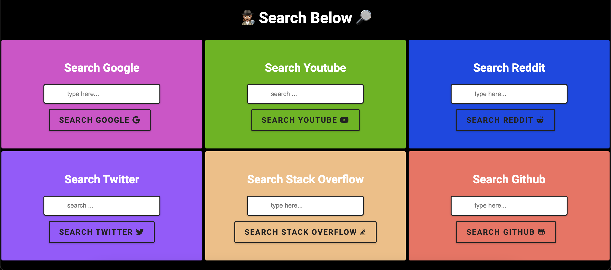

# Search Forms :mag_right: 

Search six website from one. 

        

Made with *HTML* and *CSS*

This project was practice with html forms actions, input, and identifying the query (search) strings of different websites.

>Screenshot

